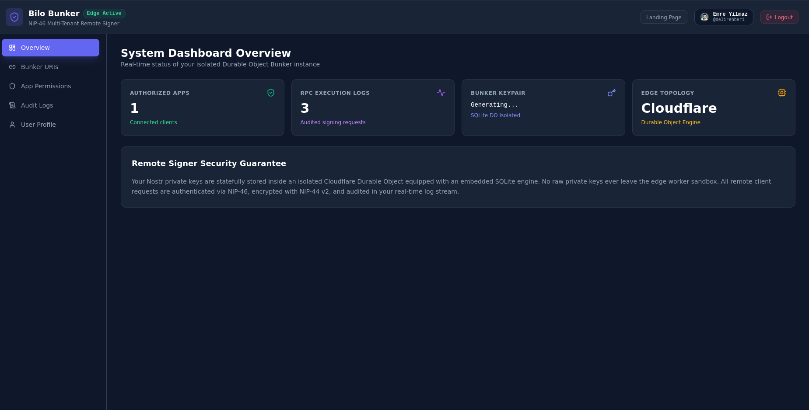
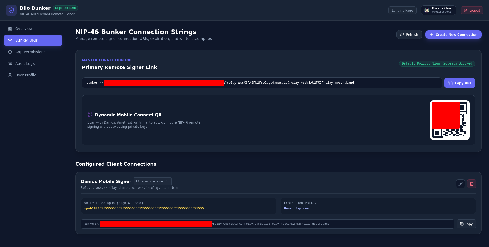
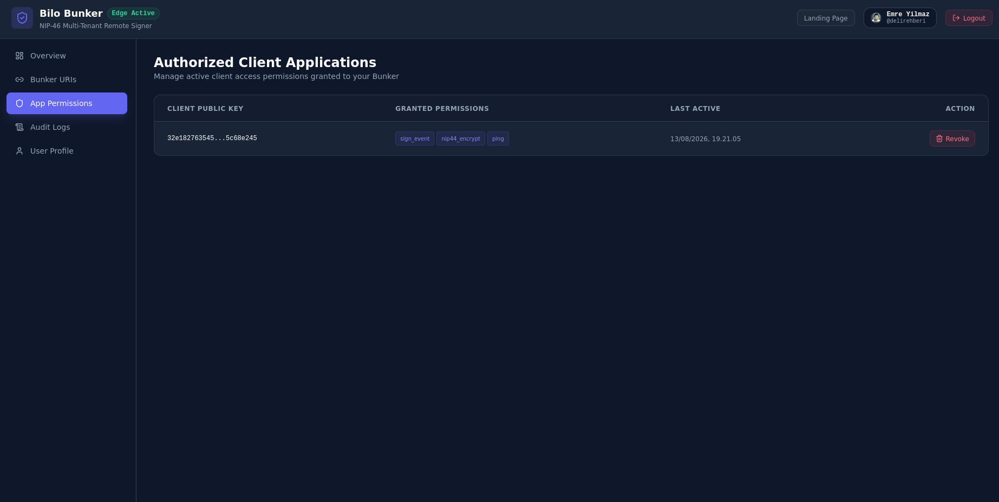
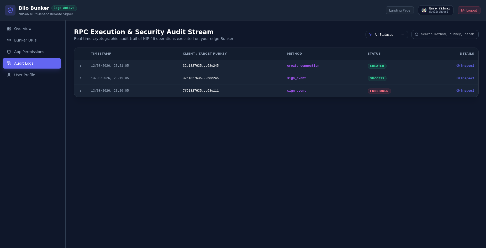

# ⚡ Bilo Bunker

> Multi-Tenant Nostr Remote Signer (NIP-46) & Management Dashboard built for Docker & Node.js.

[](https://github.com/workouse/bilo-bunker/actions/workflows/ci.yml)
[](https://github.com/workouse/bilo-bunker/actions/workflows/docker-publish.yml)
[](https://github.com/workouse/bilo-bunker/pkgs/container/bilo-bunker)
[](https://github.com/nostr-protocol/nips/blob/master/46.md)
[](LICENSE)

---

## 📌 Architecture Overview

**Bilo Bunker** is a stateful, multi-tenant Nostr remote signing service (NIP-46). It enables users to keep their Nostr private keys securely stored while responding to remote signing requests from authorized Nostr clients across Nostr relays.

- **Backend Application Engine (Hono + Node.js):** Handles NIP-46 RPC signing commands, NIP-05 profile verification, and SQLite persistent storage.
- **Auto-SSL Reverse Proxy (Caddy 2):** Provisions and auto-renews Let's Encrypt / ZeroSSL TLS certificates for your domain out of the box.
- **TailAdmin React UI SPA:** Modern dashboard allowing users to log in with NIP-07 (`window.nostr`), view active `bunker://` URIs, revoke client permissions, and audit real-time RPC logs.

---

## 🖼️ Management Dashboard Screenshots

| System Dashboard Overview | NIP-46 Bunker Connection URIs & QR |
|:---:|:---:|
|  |  |

| Authorized App Permissions | Real-Time Security Audit Stream |
|:---:|:---:|
|  |  |

---

## 🎭 Why "Bilo Bunker"?

In the legendary 1980 Turkish cinema classic *Banker Bilo*, Maho promises naive villagers safe transport to Germany, only to deceive them, abandon them in Istanbul, and pocket their money. In the Nostr ecosystem, centralized key management services act like "Maho"—promising convenience while taking custody of your private keys.

Bilo learned the hard way, took control of his own fate, and became the ultimate self-sovereign **Banker Bilo**. With **Bilo Bunker**, you own your keys, run your own isolated signing engine, and never have to ask: *"Yaptım ama bir sor niye yaptım?"* ("I did it, but ask me why I did it?").

---

## 🚀 Quickstart Production Deployment

### Option A: One-Step Server Installer (Single Line)

Deploy or update Bilo Bunker on any Linux VPS with **Zero-Config Auto-SSL** via a single command:

```bash
curl -fsSL https://bunker.workouse.com/install.sh | bash
```

Or via GitHub:
```bash
curl -fsSL https://raw.githubusercontent.com/workouse/bilo-bunker/master/scripts/install.sh | bash
```

### Option B: Manual Docker Compose Stack

```bash
# 1. Clone repository
git clone https://github.com/workouse/bilo-bunker.git
cd bilo-bunker

# 2. Configure environment
cp .env.dist .env
nano .env

# 3. Launch single-command production stack
docker compose up -d
```

### Alternatively run via GHCR Standalone Docker Container:

> **Note:** The standalone container image (`ghcr.io/workouse/bilo-bunker:latest`) runs the Node.js application engine directly on port `3000`. It does not contain ACME/Certbot. For automated TLS certificate provisioning (Let's Encrypt / ZeroSSL on ports 80/443), use the `docker compose up -d` stack above which includes the Caddy reverse proxy.

```bash
docker run -d \
  --name bilo-bunker \
  -p 3000:3000 \
  -v bilo_data:/data \
  -e DOMAIN=bunker.example.com \
  -e OWNER_PUBKEY=npub1yourpublickey \
  ghcr.io/workouse/bilo-bunker:latest
```

> **Using your own reverse proxy (Nginx Proxy Manager, Traefik, nginx, ...)?** Make sure it forwards the original `Host` header and sets `X-Forwarded-Proto` (most do by default). Dashboard requests are authenticated with NIP-98, which signs the exact public URL, so the app has to know it was reached over `https://`. If your proxy can't forward these headers, set `PUBLIC_URL=https://bunker.example.com` instead.

---

## 👥 Operating Modes

Bilo Bunker runs in one of two modes, chosen at startup from the environment:

| | Multi-user mode (default) | Single-user mode |
|---|---|---|
| **Enabled by** | No secret key set. `OWNER_PUBKEY` / `OWNER_NPUB` is optional | `OWNER_NSEC` set (aliases `OWNER_SECRET_KEY`, `NSEC`) |
| **Signing key** | A bunker key generated on first start and stored in SQLite | Your own key: the bunker signs as you |
| **Who can log in** | Anyone with a NIP-07 extension; each user's connections are isolated | Only the owner; other pubkeys get `403 Forbidden` |
| **Key formats** | `npub1…` or 64-char hex | `nsec1…` or 64-char hex |

If both are set, **`OWNER_NSEC` wins** and the instance runs in single-user mode. For the public key, `OWNER_NPUB` is read before `OWNER_PUBKEY`. The startup log shows which mode is active (`[bunker] Operating in … MODE`).

> **⚠️ Security:** in single-user mode your nsec lives in an environment variable, so anyone with access to the host, the `.env` file or `docker inspect` can read it. Keep `.env` private (`chmod 600 .env`) and use multi-user mode if you don't need the bunker to sign with your own key.
>
> **⚠️ Switching to single-user mode replaces the stored bunker key.** The previously generated key is deleted from the database, so existing `bunker://` URIs stop working. Run `make backup` first if you may want to switch back.

---

## ⚙️ Environment Variables Reference

| Variable | Description | Required | Default |
|---|---|---|---|
| `DOMAIN` | Primary domain name (e.g. `bunker.example.com` or `localhost`) | Yes | `localhost` |
| `CERTBOT_EMAIL` | Email address for Let's Encrypt / ZeroSSL TLS notifications (used by Caddy in Docker Compose) | Optional (for Docker Compose) | `""` |
| `OWNER_PUBKEY` | Multi-user mode: Nostr public key of the instance admin (`npub1…` or 64-char hex). Alias: `OWNER_NPUB` (takes precedence) | No | `""` |
| `OWNER_NSEC` | Enables **single-user mode**: the owner's Nostr secret key (`nsec1…` or 64-char hex). Aliases: `OWNER_SECRET_KEY`, `NSEC`. See [Operating modes](#-operating-modes) | No | `""` |
| `DEFAULT_RELAYS` | Comma-separated WebSocket Nostr relays to connect to | No | `wss://relay.damus.io,...` |
| `PORT` | Node.js application server internal port | No | `3000` |
| `DB_PATH` | Path to SQLite database file inside container | No | `/data/bunker.db` |
| `LOG_LEVEL` | Application logging verbosity (`error`, `warn`, `info`, `debug`). Per-request NIP-46 logs only appear at `debug` | No | `info` |
| `INSTALL_SCRIPT_PATH` | Advanced: path of the installer served at `/install.sh`. Set in the Docker image; defaults to the repo's `scripts/install.sh` otherwise | No | `/app/scripts/install.sh` (Docker) |
| `PUBLIC_URL` | Public origin the dashboard is served from (e.g. `https://bunker.example.com`). Only needed if your reverse proxy does not forward the `Host` and `X-Forwarded-Proto` headers | No | `""` |

---

## 🛠️ Local Development & DX

### Prerequisites
- Node.js `^22.0.0` (managed via `nvm`)
- `pnpm` (`npm i -g pnpm`)
- Docker & Docker Compose

### Developer Commands

```bash
# First-time setup wizard
make blackstart

# Install monorepo workspace dependencies
make install

# Start local dev environment
make dev

# Typecheck monorepo
make typecheck

# Lint codebase
make lint

# Run Vitest test suite
make test

# Build production artifacts
make build

# Build local Docker image
make docker-build

# Launch production stack via Docker Compose
make docker-up

# Stop production stack
make docker-down

# Tail Docker Compose logs
make docker-logs

# Shell into application container
make docker-shell

# Create transaction-consistent SQLite database backup
make backup

# One-step installer execution
make install-remote
```

---

## 📂 Monorepo Structure

```
bilo-bunker/
├── .github/              # CI/CD Workflows (CI, GHCR publish)
├── Caddyfile             # Caddy reverse proxy & Auto-SSL config
├── Dockerfile            # Unified production multi-stage build
├── docker-compose.yml    # Production service orchestration
├── Makefile              # Developer automation shortcuts
├── scripts/              # Setup & deployment scripts (blackstart.sh, install.sh)
├── packages/
│   ├── app/              # Hono Node.js backend engine & SQLite persistence
│   └── ui/               # TailAdmin React SPA & NIP-07 Dashboard
├── CONTRIBUTING.md       # Contribution guidelines
├── CODE_OF_CONDUCT.md    # Contributor Covenant v2.1
├── SECURITY.md           # Security disclosure policy
└── DEPLOY.md             # Detailed deployment & ops guide
```

---

## 🤝 Community & Governance

- [Roadmap](ROADMAP.md)
- [Contributing Guidelines](CONTRIBUTING.md)
- [Code of Conduct](CODE_OF_CONDUCT.md)
- [Security Policy](SECURITY.md)

---

## 📄 License

Released under the [MIT License](LICENSE).

